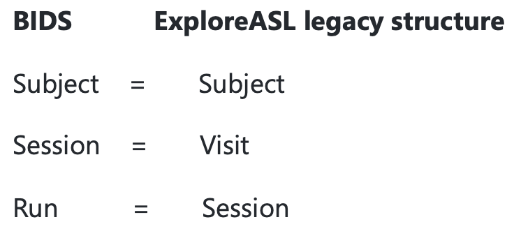
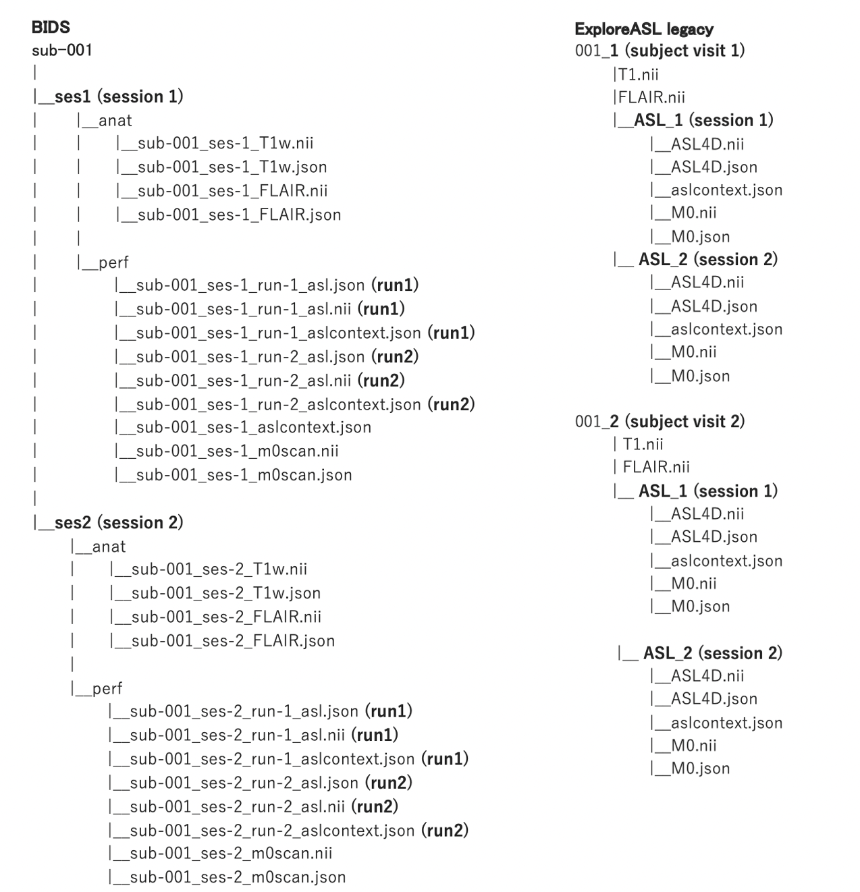

# Tutorials (Execution)


## ExploreASL & ASL-BIDS

Starting with version **v1.7.0**, **ExploreASL** will support an import workflow which allows the user to convert **DICOM** and **NIFTI** data to the **ASL-BIDS** format. Since **ExploreASL** does not fully utilize the **BIDS** format internally, there will also be an automated workflow to convert from **ASL-BIDS** to the **ExploreASL** **legacy format** (starting with version **v1.10.0**, this will be done automatically if needed). In the following subsections we will explain how you can use the automated **ExploreASL** import workflow to convert your input data to **ASL-BIDS** and how you can process it.

----
## Basic ExploreASL Execution
To start **ExploreASL**, you utilize the `ExploreASL` script. Below is a basic description of the most typical use cases:

**Initialization only:**
To only initialize the package, you execute:

`[x] = ExploreASL();`

Initialization adds paths to all atlases and functions needed for ExploreASL execution. Initialization is also run automatically before any command for processing or importing data.

**Processing ASL-BIDS data:**
To fully process data in ASL-BIDS format located in `drive/.../datasetRoot/rawdata` (note that since version **v1.10.0**, the `rawdata` are converted to the Legacy format in `derivatives` automatically without needing to call the import:

`[x] = ExploreASL('drive/.../datasetRoot', 0, 1);`

**Importing DICOM to ASL-BIDS:**
To import DICOM data located in `drive/.../datasetRoot/sourcedata` and convert them to ASL-BIDS format (see more in [Tutorial on Import](./../Tutorials-Import/)):

`[x] = ExploreASL('drive/.../datasetRoot', [1 1 0], 0);`

**Importing DICOM to ASL-BIDS:**
To import DICOM data located in `drive/.../datasetRoot/sourcedata` to ASL-BIDS and fully process them:

`[x] = ExploreASL('drive/.../datasetRoot', [1 1 0], 1);`

**Structural and ASL processing of ASL-BIDS data:**
To run the Structural and ASL processing on data in ASL-BIDS format located in `drive/.../datasetRoot/rawdata`:

`[x] = ExploreASL('drive/.../datasetRoot', 0, [1 1 0]);`

**Population module on pre-processed data:**
To run the Population module on previously processed data stored in `drive/.../datasetRoot/derivatives/ExploreASL`:

`[x] = ExploreASL('drive/.../datasetRoot', 0, [0 0 1]);`

----
## ExploreASL Execution - full input description
Below is a complete description of all the options for import and processing. ExploreASL is executed with the following command:

```matlab
[x] = ExploreASL([DatasetRoot, ImportModules, ProcessModules, bPause, iWorker, nWorkers])
```
**Parameter descriptions:**

- `DatasetRoot`: Path to the BIDS dataset root directory, which contains either the DICOM data in `sourcedata` subfolder, or ASL-BIDS data in `rawdata` subfolder or already processed data with ExploreASL in `derivatives\ExploreASL` subfolder (`OPTIONAL`)

    |                  | DatasetRoot           |
    | ---------------- |:---------------------:|
    | **Type**         | `CHAR ARRAY`          |
    | **Default**      | Prompting user input  |

- `ImportModules`: Multi-step import workflow. Note that either a vector is provided or a scalar (which is then translated as `[1 1 0]`, i.e. skipping the deface module unless explicitly turned on) (`OPTIONAL`). Note that the BIDS to LEGACY conversion from the ASL-BIDS in `rawdata` to ExploreASL format in `derivatives\ExploreASL` is now run automatically when needed as part of the Processing Module
    - `DCM2NII`: Run the DICOM to NIFTI conversion from `sourcedata` subfolder and saves to `derivatives\ExploreASL\temp` subfolder
    - `NII2BIDS`: Run the NIFTI to BIDS conversion from subfolder `derivatives\ExploreASL\temp` and saves the complete ASL-BIDS data to a `rawdata` subfolder
    - `DEFACE`: Run the defacing of structural scans with input and output to the `rawdata` subfolder


    | ImportModules    | DCM2NII       | NII2BIDS      | DEFACE           |
    | ---------------- |:-------------:|:-------------:|:-------------:|
    | **Type**         | `BOOLEAN`     | `BOOLEAN`     | `BOOLEAN`|
    | **Default**      | `false`       | `false`       | `false` |
    
- `ProcessModules`: Multi-step processing pipeline. Either a full vector, or scalar turning all options either on or off, can be used (`OPTIONAL`)
    - `STRUCTURAL`: Run the Structural Module
    - `ASL`: Run the ASL Module
    - `POPULATION`: Run the Population Module
    
    | ProcessModules   | STRUCTURAL    | ASL           | POPULATION    |
    | ---------------- |:-------------:|:-------------:|:-------------:|
    | **Type**         | `BOOLEAN`     | `BOOLEAN`     | `BOOLEAN`     |
    | **Default**      | `false`       | `false`       | `false`       |  
    
- `bPause`: Pause workflow before ExploreASL pipeline to review input parameters (`OPTIONAL`)

    |                  | bPause                |
    | ---------------- |:---------------------:|
    | **Type**         | `BOOLEAN`             |
    | **Default**      | `false`               |

- `iWorker`: Allows parallelization when called externally - see the option below (`OPTIONAL`)

    |                  | iWorker               |
    | ---------------- |:---------------------:|
    | **Type**         | `INTEGER`             |
    | **Default**      | `1`                   |

- `nWorkers`: Allows parallelization when called externally - it assumes that the user calls himself `nWorkers` instances of ExploreASL and that the current instance has number `iWorker`. It   (`OPTIONAL`)

    |                  | nWorkers              |
    | ---------------- |:---------------------:|
    | **Type**         | `INTEGER`             |
    | **Default**      | `1`                   |

In the following examples, we want to show how you can use the revised import workflow and how the conventional processing is done now. Another example for the import module is shown in the [Import Tutorial](./../Tutorials-Import/).

----
## DICOM source data

Converting DICOM source data according to the [ASL BIDS](https://bids-specification.readthedocs.io/en/latest/99-appendices/12-arterial-spin-labeling.html) standard can be done using the new import workflow. For the upcoming release **v1.7.0** we're preparing an exemplary DICOM source dataset based on the [ASL DRO](https://pypi.org/project/asldro/). To run this workflow, you have to use the path to your **dataset root directory**. This dataset root directory should contain a `sourceStructure.json` file, a `studyPar.json` file (see [Import Tutorial](./../Tutorials-Import/) for details) and optionally also a `dataPar.json` file (see the Processing Tutorial [Processing Tutorial](./../Tutorials-Processing/)). Do not forget to set up the source dataset in `drive/.../datasetRoot/sourcedata` correctly. We're working on a flavor library, to enable the import and processing of a wide variety of different sequence, vendor, and scanner combinations.

The first step to convert your **DICOM** source data to **NIFTI** source data is to run the following command:

`[x] = ExploreASL('drive/.../datasetRoot', [1 0 0],1);`

Here we tell **ExploreASL** to run the `DCM2NII` import module by setting the first boolean variable of the `ImportModules` to `1`. The output is save to `drive/.../datasetRoot/derivatives/ExploreASL/temp`

----
## NIFTI source data

Let's assume we have intermediate **NIFTI** data now in `drive/.../datasetRoot/derivatives/ExploreASL/temp`. To convert this intermediate data to **ASL-BIDS** raw data, we have to run the second part of the import workflow. To run the second step, we set the second variable of the `ImportModules` to `1`. Similar to the previous step, we pass the `datasetRoot` directory to **ExploreASL**. The output is then written to `drive/.../datasetRoot/rawdata`.

`[x] = ExploreASL('drive/.../datasetRoot', [0 1 0], 0);`


----
## Data defacing

There's also a new option to deface your structural scans. To do this, you can run the third step of the import workflow. This is done by setting the third variable of the `ImportModules` to `1`. Similar to the previous steps, we pass the `DatasetRoot` directory to **ExploreASL**. Both input and output directory is `drive/.../datasetRoot/rawdata`

`[x] = ExploreASL('drive/.../datasetRoot', [0 0 1], 0);`


----
## Data in ExploreASL legacy format

Right now, **ExploreASL** still uses the conventional data structure. The conversion from our **ASL-BIDS** rawdata to the **ExploreASL** legacy format is done (since version **v1.10.0**) automatically as the first step of the Processing Module if needed. The input ASL-BIDS data from `drive/.../datasetRoot/rawdata` are converted to `drive/.../datasetRoot/derivatives/ExploreASL/`

This step will also copy and adapt your provided `drive/.../datasetRoot/rawdata/dataPar.json` file to `drive/.../datasetRoot/derivatives/ExploreASL/dataPar.json` or create a default one if `drive/.../datasetRoot/rawdata/dataPar.json` is missing. To adapt your pipeline, you can edit the `drive/.../datasetRoot/derivatives/ExploreASL/dataPar.json` file before running the Structural and ASL modules.

----
## ExploreASL processing pipeline

If you just want to use the conventional **ExploreASL** processing pipeline, you can simply turn off the import workflow by setting all `ImportModules` variables to `0` individually or by using a single `0` for the `ImportModules`. This results in the following notation:

`[x] = ExploreASL('drive/.../datasetRoot', 0, 1);`

To run individual modules, you can set the `ProcessModules` individually. If you only want to the `Structural Module` for example, you can use a `[1 0 0]` vector. To run all modules, you can use a single `1` or a vector of ones, which should look like this `[1 1 1]`. Running the just the structural module or the full processing pipeline can therefore be done like this as well:

`[x] = ExploreASL('drive/.../datasetRoot', 0, [1 0 0]);`
`[x] = ExploreASL('drive/.../datasetRoot', 0, [1 1 1]);`

----
## BIDS format vs Legacy format
Note that the ASL-BIDS standard was introduced relatively recently and there are still certain differences between BIDS and ExploreASL terminology as shown below:

{ width="300" }

In ExploreASL, we differentiate visits and sessions mostly by the fact that within a single session a single structural scan (for each contrast) and one or more ASL scans are acquired (typically during the same scanning session and with or without repositioning). Different visits are separated by days/months or in special case several hours and the whole scanning protocol is acquired on each Visit including one or more ASL scan. So across sessions, the same structural images are used. Across Visits, the structural scans are newly acquired. In BIDS-ASL, we use the terms Sessions and Runs instead of Visits and Sessions in ExploreASL.

Here is an example:

{ width="630" }


----
## Full pipeline

Running the full pipeline including both import workflow and processing pipeline, can be done by setting both `ImportModules` and `ProcessModules` to `1`. 

`[x] = ExploreASL('drive/.../datasetRoot', 1, 1, 0, 1, 1);`

Any sensible combinations of import and processing submodules are of course also possible.

----
## Changes in v1.7.0

Compared to versions before v1.7.0, we changed both name and behavior of the `SkipPause` variable. The variable is called `bPause` now. Setting it to `true` or `1`, will result in the pipeline being paused before the processing. We removed the `iModules`, but the functionality of `ProcessModules` is basically the same. We use boolean notation now, so instead of `[1 2 3]` you have to use `[1 1 1]` now.

The overall import functionality is a work in progress right now. We expect stable behavior in release `v1.7.0` though. If you plan on using the `develop` branch until then, you have to live with more or less unstable import behavior.

## Changes in v1.10.0

BIDS to Legacy conversion is now not done as the last step of import, but it is run automatically when needed (i.e. BIDS data existing and Legacy data not present) as the first step of the Processing Module.
