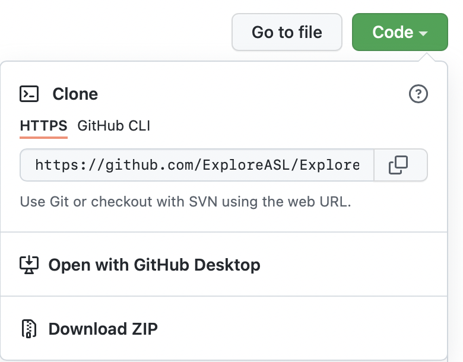
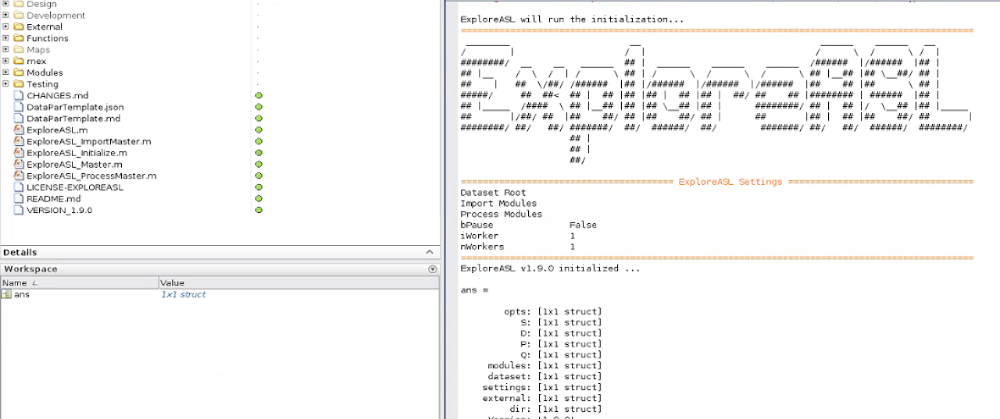

# Tutorials (Installation)


This tutorial describes where to download, how to install, and how to run ExploreASL either directly from Matlab, or using a compiled version or a docker that do not require Matlab license. All external software, like SPM and dcm2niix, is contained in all the downloads and does not need to be downloaded or installed separately. The only exception is the [FSL software](https://fsl.fmrib.ox.ac.uk/fsl/fslwiki/FslInstallation) that needs to be downloaded and installed manually in case you want to process multi-PLD or time-encoded ASL data using BASIL or use TOP-UP. The installation guide is at the end of this page.

[ExploreASL GUI](https://github.com/MauricePasternak/ExploreASLJS) is a standalone wrapper around ExploreASL that provides a modern and user-friendly interface for importing, processing, analyzing, and visualizing ASL data with ExploreASL.

----
## How to run ExploreASL using Matlab


The first thing you have to do, to use **ExploreASL**, is to clone the **ExploreASL** repository. If you want to run **ExploreASL** from Matlab, we recommend to clone the main repository directly from the official [GitHub website](https://github.com/ExploreASL/ExploreASL). You also have the option to download the zipped version (click Donwload zip) or clone it with GitHub. Both stable [release](https://github.com/ExploreASL/ExploreASL/releases) and [latest beta](https://github.com/ExploreASL/ExploreASL/tree/develop) version are available.



If you are new to Matlab, we recommend checking out a [Matlab tutorial](https://www.mathworks.com/support/learn-with-matlab-tutorials.html). It can be helpful to add the **ExploreASL** directory to your Matlab paths. Open Matlab, select the **Home** tab, and add the **ExploreASL** directory including its subfolders using the **Set Path** option. Now change your working directory, using the **Current Folder** tab or the **cd** command, to the **ExploreASL** directory.

Running a simple initialization is a good first check that everything is working
```matlab
ExploreASL();
```



To run **ExploreASL** you have to type in the following command in the **Command Window**: `ExploreASL`. You will need an already created **[ASL-BIDS](https://bids-specification.readthedocs.io/en/stable/04-modality-specific-files/01-magnetic-resonance-imaging-data.html) dataset** and specify the path to it, you can run the default **ExploreASL** pipeline like this:

```matlab
DatasetRoot = 'C:\...\MY-BIDS-DATASET'; % Path to the Dataset folder, containing the ASL-BIDS data in C:\...\MY-BIDS_DATASET\rawdata
ImportModules = [0 0 0 1]; % Import data from ASL-BIDS format to ExploreASL internal format
ProcessModules = true;
[x] = ExploreASL(DatasetRoot, ImportModules, ProcessModules);
```

For running ExploreASL full import from DICOM data, please consult the [Tutorial on Import](./../Tutorials-Import/). 
You can also execute a test dataset provided with ExploreASL in the folder ExploreASL/External/TestDataSet:

```matlab
ExploreASL('/home/user/.../ExploreASL/External/TestDataSet', 0, 1);
```

See more information in the Tutorial [here](./../Tutorials-QC).

----
## How to run a compiled ExploreASL Version

Precompiled ExploreASL is available for certain ExploreASL versions and OSes [here](https://drive.google.com/drive/folders/1z6fbW6GnlmPhicXvXcRtGZQxptujN7o1). Providing a compiled version for every operating system and corresponding Matlab version is currently not feasible for us. Please feel free to ask the developers for a specific compiled version. 

A compiled version of ExploreASL always requires the corresponding Matlab Runtime. Please checkout the official [Matlab Documentation](https://mathworks.com/products/compiler/matlab-runtime.html). Download the Matlab Runtime of the Matlab Version which was used for the compilation. Make sure to install the Matlab Runtime correctly. If you're using Windows, it is important that the path to the Matlab Runtime is added to Windows **PATH** during the installation. To compile ExploreASL yourself, you have to run the `xASL_adm_MakeStandalone.m` script.

### Windows

Assume you have downloaded or compiled a file called `xASL_latest.exe`. We recommend using the command line interface now. For this you can go to the address bar of your file explorer. Type in `cmd` to open the command prompt in the current folder. The following command will start **ExploreASL**, import the **ASL-BIDS dataset** in sourcedata format, and process the dataset corresponding to your `DatasetRoot` directory:

```console
xASL_latest.exe "c:\MY-BIDS-DATASET" "1" "1"
```

The executable will extract all necessary data from the CTF archive within the folder. This is totally normal. Within the command window you should see that **ExploreASL** is starting to process the given dataset:

```console
xASL_latest.exe "c:\MY-BIDS-DATASET" "1" "1"
(insert example here)
```

To test if it is possible to initialize **ExploreASL** without the processing of a dataset, you could run the following command:

```console
xASL_latest.exe "" "0" "0"
```

The usual **ExploreASL** parameters (`DatasetRoot`, `ImportModules`, `ProcessModules`, `bPause`, `iWorker`, `nWorkers`) have to be given to the compiled **ExploreASL** version as strings. The resulting output could look like this:

```console
xASL_latest.exe "" "0" "0"
(insert example here)
```

### Linux

On Linux you can basically do the same as above. We can run the ExploreASL shell script with a specified Matlab MCR (here we use **version 96** e.g.) using the following command:

```console
./run_xASL_latest.sh /usr/local/MATLAB/MATLAB_Runtime/v96/ "" "0" "0"
```

Using the options `"" "0" "0"` we initialize **ExploreASL**, but do not process a dataset. To run a dataset, we have to switch the `ImportModules` and/or the `ProcessModules` parameter from `0` to `1` and pass a path for the `DatasetRoot` directory. This could look something like this:

```console
./run_xASL_latest.sh /usr/local/MATLAB/MATLAB_Runtime/v96/ "/home/MY-BIDS-DATASET" "1" "1"
(insert example here)
```


----
## How to run ExploreASL using the docker image

First you have to pull an official docker image from the **ExploreASL** repository:

```console
docker pull exploreasl/xasl:latest
```

Check out your local images using `docker images`. If you want to rename the docker image, tag your image using the docker tag command:

```console
docker tag exploreasl/xasl:latest xasl:my-version
```

To start a docker container of **ExploreASL v1.7.0** e.g., you can use the following command:

```console
docker run -e DATASETROOT=MY-BIDS-DATASET
       -e IMPORTMODULES=1 -e PROCESSMODULES=1
       -v /home/.../incoming:/data/incoming 
       -v /home/.../outgoing:/data/outgoing xasl:1.7.0
```

- Here `DATASETROOT` is an environment variable which is a relative path to the `DATASETROOT` directory of your dataset.
- The `IMPORTMODULES` and `PROCESSMODULES` are the parameters of ExploreASL_Master
- `/home/.../incoming:/data/incoming` is used to mount your dataset folder (`/home/.../incoming`) to its corresponding docker dataset folder (`/data/incoming`). 
- The same notation is used to mount the docker dataset output folder (`/data/outgoing`) to its corresponding real output folder on your drive (/home/.../outgoing`).

If your system admin blocks docker due to root requirements you can run singularity or podman described below:

### Singularity
For versions before **ExploreASL v1.12.0** you will need to use fakeroot in singularity due to the location of file transfers inside of the container.
```console
singularity run
       --fakeroot
       --writable-tmpfs
       --env DATAROOT=TestDataSet
       --env IMPORTMODULES=0
       --env PROCESSMODULES=1
       --bind /home/.../incoming-data/:/data/incoming,/home/.../outgoing-data/:/data/outgoing  xasl_latest.sif 
```

Due to a difference in docker design `--fakeroot` is no longer necessary starting from the image **ExploreASL v1.12.0**

```console
singularity run
       --writable-tmpfs
       --env DATAROOT=TestDataSet
       --env IMPORTMODULES=0
       --env PROCESSMODULES=1
       --bind /home/.../incoming-data/:/data/incoming,/home/.../outgoing-data/:/data/outgoing  xasl_latest.sif
```

### Podman
If your system uses podman and SELinux you can run and mount the container using the following command:
```console
podman run -e DATAROOT=TestDataSet
       --mount type=bind,source=/home/.../incoming-data,target=/data/incoming,Z
       --mount type=bind,source=/home/.../outgoing-data,target=/data/outgoing,Z xasl:latest
```

----
## How to install and run FSL in ExploreASL

Please install the standard compiled version of FSL. FSL version >= 6 is recommended for most applications. Version >= 6.0.7.6 is needed if you want to use FABBER to process BBB-permeability images with multi-TE ASL.

Please consult the [FSL installation guide](https://fsl.fmrib.ox.ac.uk/fsl/fslwiki/FslInstallation). For use on Windows, you need to install Windows Subsystem for Linux (WSL or WSL2). The default WSL Linux version Ubuntu should be fine, 
though use the version WSL2 that is recommended in the [FSL installation instructions](https://fsl.fmrib.ox.ac.uk/fsl/fslwiki/FslInstallation/Windows).
