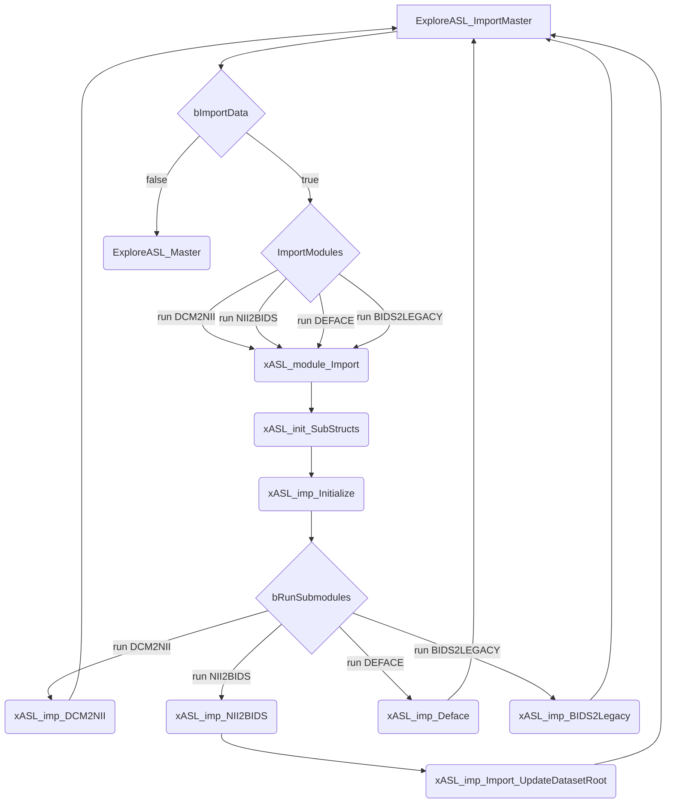
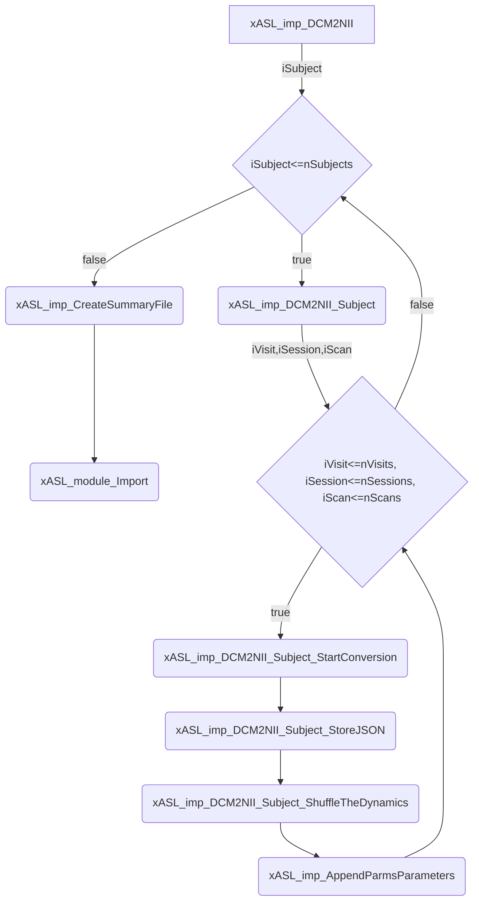
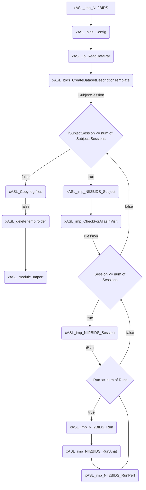

# Flow Charts

Check out [mermaid](https://github.com/mermaid-js/mermaid) and its [live editor](https://mermaid-js.github.io/mermaid-live-editor). Download the browser extensions [here](https://github.com/BackMarket/github-mermaid-extension).

## Import



### DCM2NII



### NII2BIDS



### BIDS2LEGACY

```mermaid
graph TD
    A[xASL_imp_BIDS2Legacy] --> B(xASL_bids_BIDS2Legacy)
    B --> C(xASL_bids_Config)
    C --> |iSubjSess| D{iSubjSess <= num of SubjSessions}
    D --> |false| E(Run xASL_bids_parseM0 if M0 exists)
    E --> F(Create dataPar.json if it does not exist)
    F --> G(Copy participants.tsv if it does exist)
    G --> H(Add GeneratedBy field to legacy sidecars)
    H --> I(Clean-up)
    I --> J(ExploreASL_ImportMaster)
    D --> |true| K(xASL_TrackProgress)
    K --> |iVisit| L{iVisit <= num of Visits}
    L --> |true| M(xASL_adm_CreateDir)
    M --> |iModality| N{iModality <= num of Modalities}
    N --> |true| O(...) %% we should really put this functionality in subfunctions
    N --> |false| L
    L --> |false| D
    O --> N
```


