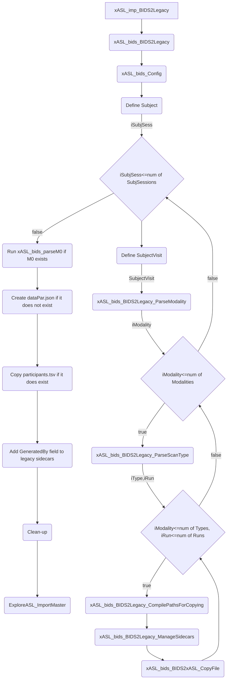

# Flow Charts

Check out [mermaid](https://github.com/mermaid-js/mermaid) and its [live editor](https://mermaid-js.github.io/mermaid-live-editor). Download the browser extensions [here](https://github.com/BackMarket/github-mermaid-extension).

## Import

### DCM2NII

### NII2BIDS

### BIDS2LEGACY

